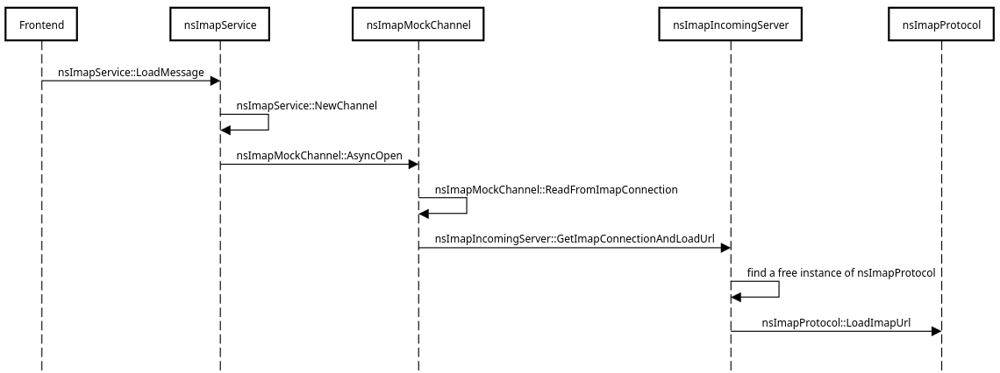
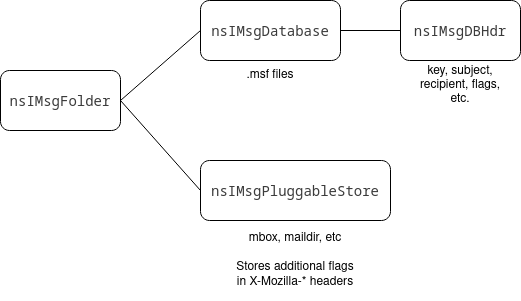

# Implementation architecture for email protocols

This document describes the code architecture used by protocol implementations
in Thunderbird. Its aim is to give more insight into existing protocol
implementations, by summarizing the interactions between the involved
components, and illustrating with the example of the IMAP protocol
implementation.

Warning

This document was initially written during the exploratory phase of the Exchange
protocol implementation into Thunderbird, when it became clear that our
understanding of what a protocol is within Thunderbird was insufficient to
tackle this project.

While the initial research has allowed us to build a solid base of documentation
on this topic, this is still very much a living document, as there will very
likely be more discoveries made and lessons learned while working through actual
protocol implementations.

Therefore, this document should be considered a work in progress for now.

## Overview

### Components

These are the main components used to implement a protocol. The frontend is
generic enough to not require protocol-specific component implementations.

* URL (`nsIURL`): Static description of a resource following a spec defined by
  the protocol implementation (therefore it might not correspond to resource
  identifiers defined by the protocol's specification, and might translate to
  more than one operation on the remote server). Sometimes it is given
  additional structures such as message
  [sinks](https://en.wikipedia.org/wiki/Sink_(computing)), channels, etc.
* Message service (`nsIMsgMessageService`): Abstraction layer that is capable of
  parsing the string representation of a URL. Also provides APIs to run specific
  messaging-related operations (load message, delete folder, edit message flags
  (if relevant), search, etc) by turning them into URLs.
* Channel (`nsIChannel`): Asynchronous layer enabling communication between a
  service (or other parts of the backend) and a server. The channel has the same
  lifetime as the request being made, and carries its parameters to the
  connection, as well as any listener or event sink needed to ferry messages
  back to the caller. It is able to start in a held state until a connection
  becomes available.
* Incoming server (`nsIMsgIncomingServer`): Represents a single server to talk to. Keeps
  track of the data needed to connect to the server (address, credentials,
  connectivity status, etc), as well as a connection pool.
* Protocol / Connection: The component that actually talks to the socket, by
  implementing the protocol's specification. Turns the URL into a set of
  operations, runs them, then feeds data back to other stakeholders via
  listeners and event sinks. This class is designed after the specific needs of
  the protocol that is being implemented, rather than based on an existing
  interface/class in order to mutualize code (which has created complications
  historically).
* Folder (`nsIMsgFolder`): Represents a single folder on the server. Provides
  APIs for performing common operations on/interacting with the folder, thus
  providing abstraction on the storage side of the operation/interaction.
* Database (`nsIMsgDatabase`): Stores the metadata and headers related to
  messages received.
* Message store (`nsIMsgPluggableStore`): Stores the content of the messages
  received.

### Relationship between components

The frontend interacts with the backend in two ways:

* By calling upon the message service to trigger operations that require
  interaction with the server
* By interacting with a global instance of `nsMsgDBView` (often wrapped into an
  instance of `DBViewWrapper`) to operate on the message database/store, usually
  through an `nsIMsgFolder` instance.

When the message service receives a call, it sends the request through a
channel. This call usually comes with a string representation of the URL for a
folder or message (or other entity, depending on the protocol), or multiple
depending on the operation. The channel is created either directly, or via
`nsIDocShell::LoadURI` if the frontend provides the message service with an
object which implements `nsIDocShell` (sometimes referred to as a display
consumer), and if the operation involves fetching a resource at the given URL.

Attached to the URL are potential parameters for the request, as well as event
sinks and listeners (which can be provided by the frontend directly) that can be
used to inform the frontend (or other intermediate party) about the state of the
operation and communicate any resulting data. In future implementations (or when
reworking existing ones), these really should be attached to the channel
instead.

The message service might also be given a reference to the `nsIMsgWindow` used
by the frontend, which it uses to feed progress updates back to it. Note that
this is likely not a viable solution going forwards, as we want to limit the
backend from directly interacting with the frontend's window.

At the other end of this channel is an incoming server, which then looks for an
available connection in its pool (or opens one if none is open and available),
and calls it with the request parameters (including the URL(s) if any) and
sinks/listeners (and any other reference necessary). The connection then talks
to the remote server via a socket using the protocol’s specification, and
communicates any data back via the listener.

The database might get a call from the frontend (either directly or through a
folder) that it cannot satisfy by itself. In this case, it can interact with the
message service to retrieve any missing data. The message store isn’t called
directly from the frontend, and is (theoretically) optional.

Other components might also interact with the message service, for example an
auto-sync loop that frequently checks for new messages (or listens for pull
notifications).

## Case study: IMAP

This section describes at a very high level how the IMAP protocol is implemented
in Thunderbird.

It is heavily summarized and focuses on understanding the function of each
component involved and the interaction between them, rather than going into
detail into all the features implemented by each of them. This is also why the
references related to inheritance don’t list all of the classes/interfaces
implemented by a given class.

### Frontend

Fortunately, the frontend part is fairly generic and protocol agnostic in most
places. When displaying a message, the frontend identifies the correct service
using `MailServices.messageServiceFromURI` with a URI retrieved from the
database, then calls `loadMessage` (which is defined by `nsIMsgMessageService`)
on this service.

The frontend is populated via listeners consuming data sent from the backend as
well as a global instance of `nsMsgDBView` (often wrapped into an instance of
`DBViewWrapper`).

### Message service

The interface layer between the frontend and the more hairy bits of the backend
(`nsImapService`, implements `nsIMsgMessageService`). The message service
provides methods for specific operations, then turns them into `nsIImapUrl`,
before passing them onto the `nsIMsgIncomingServer` and `nsImapProtocol` via an
`nsImapMockChannel`.

### URL

A single URL describes a single operation. In IMAP land, this can be your
standard fetch, or deletemsg, addmsgflags, etc. (`nsImapUrl`, implements
`nsIURL` via `nsIMsgMailNewsUrl`). One `nsImapUrl` can result in multiple IMAP
commands.

One issue with the IMAP URL is the amount of structures that don't strictly
describe the operation to perform it references. For example: instead of
attaching the URL listener and message sink that are used to carry messages
related to the operation to the channel, they're attached to the URL; the URL
keeps a reference of the `nsIImapMockChannel` used to pass it onto the
`nsIImapProtocol` instead of this reference being directly passed onto the
protocol; etc.

As previously mentioned, IMAP URLs are also used to refer to an operation rather
than a resource to retrieve (which can amount to the same thing, e.g. with a
fetch, but not always, e.g. copying a message, deleting it, etc). In other
words, the URL is the API to IMAP for the message service (and, to some extent,
the frontend). Ideally this API would live elsewhere, for example in
`nsIImapMockChannel`, `nsIMsgIncomingServer` and/or `nsIImapProtocol` which
interacts (asynchronously or not, depending on the layer) directly with the IMAP
server.

### Channel

A channel is used to ferry the information for a specific operation from the
message service to the server (`nsImapMockChannel`, implements `nsIChannel` via
`nsIImapMockChannel`). In a way, a channel can be seen as the representation of
a request to the server (with the caveat that, if the `nsImapUrl` requires it,
it might result in multiple IMAP commands).

### Incoming server

An incoming server represents an IMAP server (`nsImapIncomingServer`, implements
`nsIMsgIncomingServer`). It keeps track of the connection information for the
server, such as credentials, connectivity status, etc, as well as a pool of
active connections (`nsImapProtocol`) to it.

### Protocol

`nsImapProtocol` (implements `nsIImapProtocol` and `nsMsgProtocol`) is the class
in charge of talking to an IMAP server. Each instance is scoped to an IMAP
server, and runs on its own thread (though it’s a special case benefiting from
an exemption, and should not be reproduced in future implementations). It takes
a URL and turns it into the required IMAP commands. First
`nsImapProtocol::LoadImapUrl` is called with a URL (queued by
`nsImapIncomingServer`), then a signal is sent (via `m_urlReadyToRunMonitor`) to
`ImapThreadMainLoop` to let it know there’s a new URL to process. `IsBusy` and
`CanHandleUrl` are used to figure out whether a protocol instance can be used.
Note that these methods are inherited from `nsIImapProtocol`.

_Summarized call stack involved in loading a message._

### Storage

There are three layers to storing messages:
* Folders (`nsImapMailFolder` (implements `nsIMsgFolder`)), which provide an
  abstraction layer for basic operations on IMAP folders, and a way for the UI
  and other parts of the backend to access the database and message store
  associated with a given IMAP folder.
* Database (`nsImapMailDatabase` (implements `nsIMsgDatabase`)), which provides
  access to metadata and headers of messages. It’s used as the master list of
  messages in a folder, wherever the full messages are (stored locally, on a
  server, etc).
* Pluggable message store (implementation of `nsIMsgPluggableStore`, not
  protocol specific, existing implementations are `nsMsgMaildirStore` and
  `nsMsgBrkMBoxStore`), which stores the content of messages.

_Relationship between the layers related to storing messages._

At the time of writing, this aspect of the protocol implementation is being
redesigned to remove the strong dependency between the database/store and
individual folders.

### Rendering messages

_Summarized depiction of message rendering._

When fetching a message, the `nsImapService` calls `nsIDocShell::LoadURI`, which
means the call to `nsImapMockChannel::AsyncOpen` is done through
`DocumentLoadListener::AsyncOpen`. It instantiates the `nsImapMockChannel` by
calling `NewChannel` on the class registered with the contract ID
`@mozilla.org/network/protocol;1?name=imap` - in this case `nsImapService`.

It is likely `DocumentLoadListener` sets relevant callbacks to the
`nsIStreamListener` that is passed to `nsImapMockChannel::AsyncOpen` to load
content into the `nsIDocShell` once a message has been retrieved. More research
is needed to fully understand how this data is fed back into the docshell.
