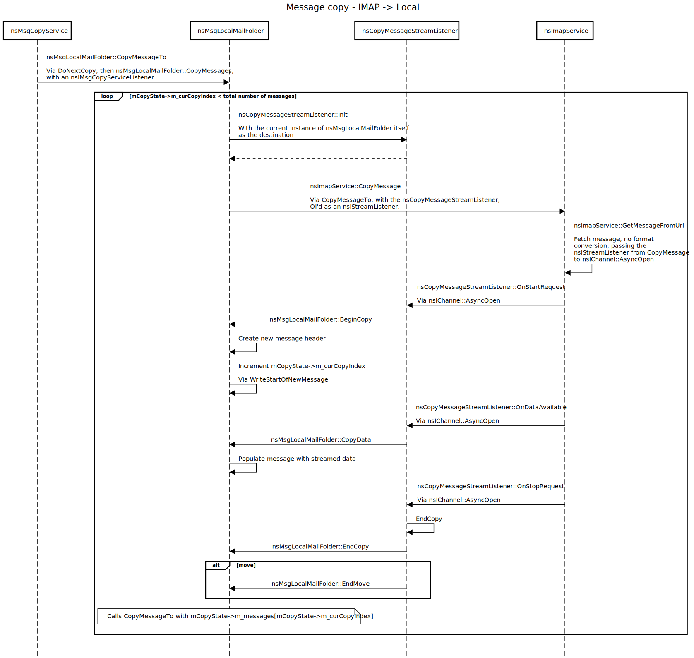

# Copying and moving messages and folders

This page aims to document the current archictecture of copy/move operations in
Thunderbird's backend. As copy and move operations share a significant amount of
code, any documentation for copy operations is also true for move operations,
unless stated otherwise.

Note

This page exists purely to document the current architecture. It does not try to
pass judgement onto it, nor is it an attempt at defining what this archictecture
might look like in the future.

This page also documents only generic, protocol-agnostic copy/move behaviors. If
messages or folders are being copied within the same account (which probably the
most common case), these operations might be handled in a different,
protocol-specific way (though `nsIMsgCopyService` and `nsIMsgFolder` methods
will usually still be the expected "entry points").

## The `nsIMsgCopyService` service

Most copy/move operations go through the `nsIMsgCopyService` service interface.
This includes:

* Copying a message from a file, i.e. creating a new message
* Copying/moving folders
* Copying/moving messages

Destination folders are expected to call `nsMsgCopyService::NotifyCompletion`
upon completing any copy/move operation. This is important as the service holds
a single-line queue that doesn't allow more than one copy to happen at the same
time, therefore failing to notify of an operation's completion will cause future
ones to be stuck indefinitely.

The `nsIMsgCopyService` service's role is to schedule/organize copy/move
operations in a centralized and protocol-agnostic way, and act as an "entry
point" for the frontend (or other protocol-agnostic parts of the application
wishing to trigger such operations). Protocol implementations usually do not
need to bother with it (beyond calling `NotifyCompletion` when they're done), as
it will call relevant methods on protocol-specific `nsIMsgFolder`
implementations by itself. It is documented here as a way to provide a
high-level picture of how message and folder copy/move operations are organized
within Thunderbird.

### Listeners

Copy/move operations involve two different listener types:

* `nsIMsgCopyServiceListener`, which is used to inform the `nsIMsgCopyService`
  *consumer* of the operation's current status. It is passed to the
  `nsIMsgCopyService` and propagated to the destination `nsIMsgFolder`.
* `nsICopyMessageListener`, which is usually implemented directly on the
  protocol-specific class that oversees the copy (such as `nsImapMailFolder` or
  Exchange's `MessageCopyHandler`). When copying a message, the class
  implementing the listener is wrapped into a `CopyMessageStreamListener`, which
  implements `nsIStreamListener` and can be used to receive message data from
  the source folder.

## Copying/creating a message from a file

When copying a message from a file (e.g. saving a message as draft/template,
moving a sent message to the Sent folder, etc.), consumers typically call
`nsIMsgCopyService::CopyFileMessage` with a handle on the file containing the
raw RFC822 message content, a reference to the folder in which to create the
message, and some additional information such as whether the new message is
supposed to replace an existing message, whether the new message is a draft,
etc. It may also take an instance of `nsIMsgCopyServiceListener`.

Through its `DoCopy` and `DoNextCopy` methods, the service will then call
`nsIMsgFolder::CopyFileMessage` on the destination folder, with that same
information and listener.

The destination folder is expected to create a new message both on the server
and locally, and to call `nsMsgCopyService::NotifyCompletion` to indicate that
the operation has ended.

## Copying a message between folders

When copying a message between folders, consumers typically call
`nsMsgCopyService::CopyMessages` with a reference to the source and destination
folders, an array of messages to copy, as well as a boolean that indicates
whether the operation is a copy or a move (`true` indicates a move). It may also
take an instance of `nsIMsgCopyServiceListener`.

Through its `DoCopy` and `DoNextCopy` methods, the service then calls
`nsIMsgFolder::CopyMessages` on the destination folder, with that same array of
messages, copy/move indicator and listener, as well as a reference to the source
folder. In most cases, the destination folder (or a specific copy "handler")
then iterates over each message and:

* calls `nsIMsgFolder::GetUriForMsg` on the source folder to get an URI for the
  message
* uses `GetMessageServiceFromURI` from `nsMsgUtils.h` to get an
  `nsIMsgMessageService` from the message's URI
* instantiates a new `CopyMessageStreamListener` wrapped around itself
* calls `nsIMsgMessageService::CopyMessage` on that service with that listener
  (passed as an `nsIStreamListener`)

The service then feeds the message's content through the listener, which in
turns feeds it to the destination folder (or handler) via its
`nsICopyMessageListener` implementation. The iteration over the list of messages
to copy is also done through this implementation: upon
`nsICopyMessageListener::EndCopy` being called, the copy of the message is
finalized, the source message is deleted if the operation was a move (and it
succeeded), and the process is repeated for the next message in line.

Note

The destination folder might skip a few steps or adopt a more bespoke behavior
if they identify that the source folder is on the same server as itself.

Below is a sequence diagram describing the workflow for a message copy operation
from an IMAP folder to a local one.

The only variation to this workflow is that in some cases, the destination
folder might call `nsIMsgMessageService::CopyMessages` with the entire array of
messages to copy. This only happens if the destination folder is a local folder,
and either:

* the source folder's protocol is IMAP and all messages in the array are
  reported as being available offline, or
* the source folder is also a local folder.

This means `CopyMessages` might not be implemented for all
`nsIMsgMessageService` implementations.

## Copying a folder

Folder copy is more or less an instrumentation of message copy. Consumers
typically call `nsIMsgMessageService::CopyFolder` with essentially the same
arguments as `nsMsgCopyService::CopyMessages` (minus the array of messages).
Through its `DoCopy` and `DoNextCopy` methods, the service then calls
`nsIMsgFolder::CopyFolder` on the destination folder with those arguments.

The destination folder (or a handler) then builds a list of all of the
subfolders under the source folder, and for each of them:

* creates a new subfolder under the destination folder
* copies all of the messages from the source subfolder to the destination one;
  it does so by either calling `nsIMsgMessageService::CopyMessage` on the
  relevant message service (in the same iterative way as previously described),
  or calling `nsIMsgFolder::CopyMessages` on the destination subfolder and
  providing `true` for its `isFolder` argument
* delete the source subfolder if the operation is a move
* move onto the next folder in the list

Note that these iterations need to happen in hierarchical order: when performing
a move, we do not want to delete a folder until we have already moved all of its
subfolders.

Once this list has been exhausted, the same operation can be performed for the
source folder itself.

Note

The destination folder might skip a few steps or adopt a more bespoke behavior
if they identify that the source folder is on the same server as itself.

